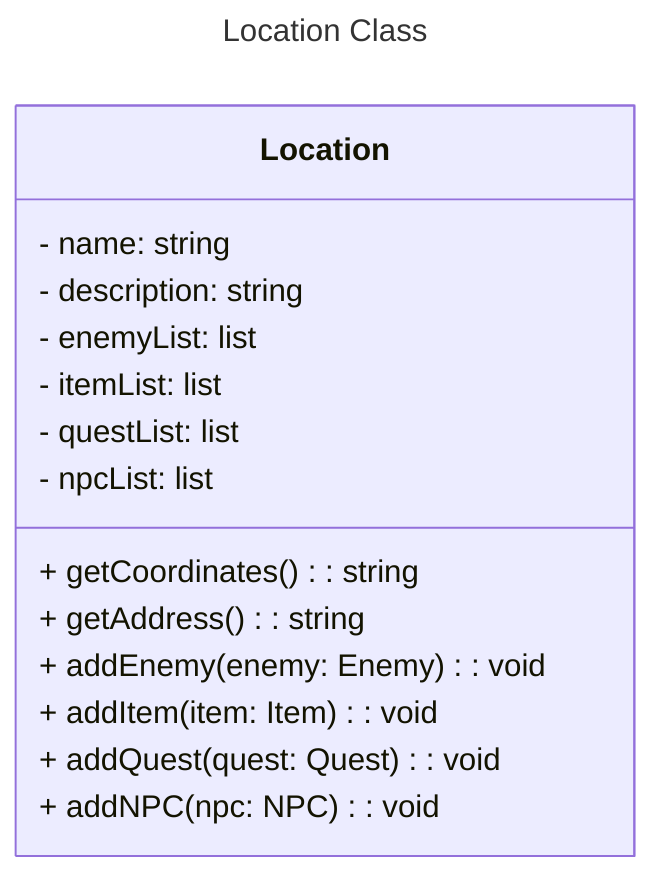

import java.util.ArrayList;
import java.util.List;

public class Location {
    private String name;
    private String description;
    private List<Enemy> enemyList;
    private List<Item> itemList;
    private List<Quest> questList;
    private List<NPC> npcList;

    public Location(String name, String description) {
        this.name = name;
        this.description = description;
        this.enemyList = new ArrayList<>();
        this.itemList = new ArrayList<>();
        this.questList = new ArrayList<>();
        this.npcList = new ArrayList<>();
    }

    public String getCoordinates() {
        return "Coordinates not implemented";
    }

    public String getAddress() {
        return "Address not implemented";
    }

    public void addEnemy(Enemy enemy) {
        enemyList.add(enemy);
    }

    public void addItem(Item item) {
        itemList.add(item);
    }

    public void addQuest(Quest quest) {
        questList.add(quest);
    }

    public void addNPC(NPC npc) {
        npcList.add(npc);
    }

    public List<Enemy> getEnemyList() {
        return enemyList;
    }

    public List<Item> getItemList() {
        return itemList;
    }

    public List<Quest> getQuestList() {
        return questList;
    }

    public List<NPC> getNpcList() {
        return npcList;
    }
}
